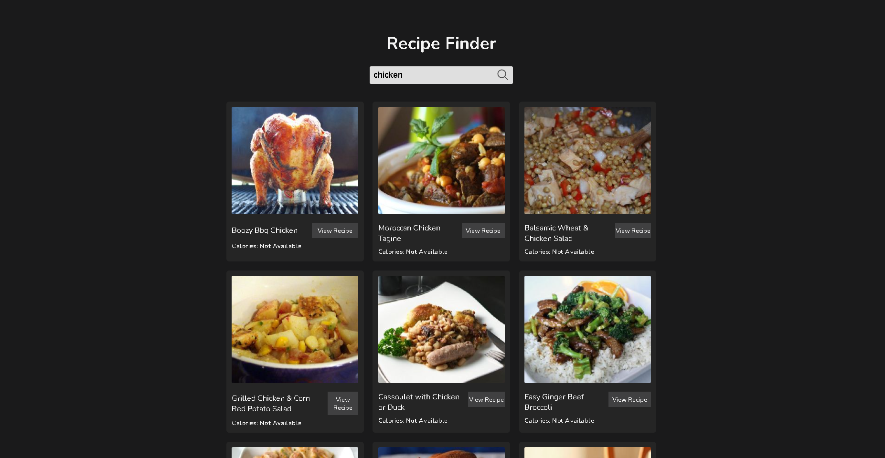

# Recipe App

A simple web app that allows users to search for recipes and view detailed nutritional information (calories) using the Spoonacular API.

## Description

This project is a Recipe App built with HTML, CSS, and JavaScript. Users can search for recipes based on ingredients and get a list of matching recipes. The app fetches data from the [Spoonacular API](https://spoonacular.com/food-api) to provide recipe information, including images, recipe links, and nutritional details (like calories).

## Demo

Here are some screenshots showing how the app works:

### 1. **Search Results**



### 2. **Recipe Details**


## Installation

1. Clone the repository:
    ```bash
    git clone https://github.com/nw-790/recipe-app.git
    ```

2. Open the project folder:
    ```bash
    cd recipe-app
    ```

3. Open `index.html` in your browser to view the app locally.

## Usage

- Enter a recipe query (e.g., "chicken") in the search bar.
- Click on the **Search** button to see a list of matching recipes.
- Click on a **View Recipe** button to open the recipe page in a new tab.
- View the recipe's calorie information and explore more recipes.

## Technologies

- HTML
- CSS
- JavaScript
- [Spoonacular API](https://spoonacular.com/food-api)
